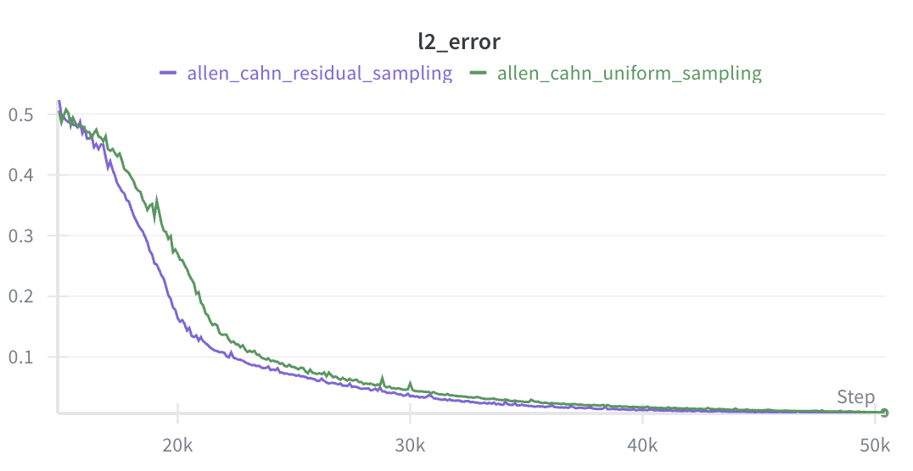
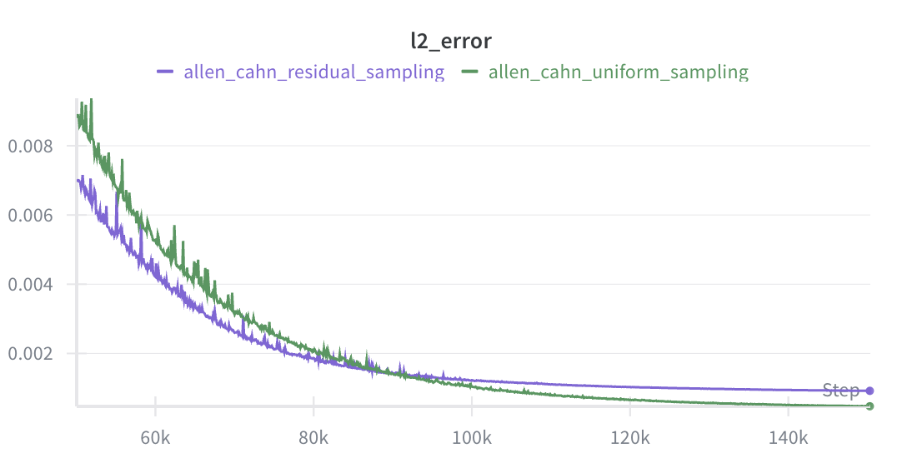
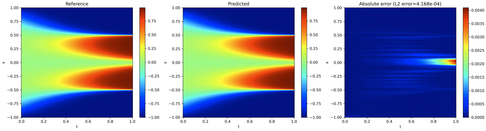

# Adaptive Residual Sampling for Physics-Informed Neural Networks (PINNs)

---

## Overview

Physics-Informed Neural Networks (PINNs) solve PDEs by minimizing residuals at randomly sampled collocation points. Most implementations rely on **uniform sampling**, implicitly assuming all regions of the domain contribute equally to learning.

This project investigates:

> Can residual-guided adaptive collocation accelerate convergence or improve sample efficiency in large-scale PINN training?

I reimplemented a distributed PINN framework in **JAX/Flax** and designed a residual-based adaptive sampling algorithm, then conducted controlled experiments across nonlinear PDE benchmarks.

---

## System Architecture

### Distributed Training Setup

- **4 × RTX A6000 GPUs**
- Data-parallel training via `jax.pmap`
- Cross-device gradient synchronization using `lax.pmean`
- Fully JIT-compiled training steps
- Global batch size: **4096 collocation points**
- ~265K-parameter MLP (4 hidden layers × 256 width) with Fourier + periodic embedding enabled
- 200K training steps per experiment
- ~30–60 minutes per experiment

The framework is modular, enabling controlled ablation studies by swapping:

- PDE backends
- Sampling strategies
- Loss weighting schemes
- Scheduling policies

All experiments hold architecture, optimizer, and learning rate schedule fixed to isolate sampling effects.

---

## Adaptive Residual Sampler

### Baseline: Uniform Sampling

Each training step samples collocation points uniformly across the space-time domain.

### Proposed: Hybrid Residual Sampling

Each batch samples:

- (1 − p) fraction uniformly
- p fraction from a persistent **hard bank**

Hard bank construction:

1. Periodically sample a large candidate pool.
2. Evaluate PDE residuals.
3. Select top-k highest-residual points.
4. Insert into persistent hard bank.
5. Sample uniformly from this bank during training.

A scheduled mixing coefficient `p` controls the exploration–exploitation balance.

### Residual Sampler Workflow

1. Sample N candidate points
2. Evaluate residuals (distributed across GPUs)
3. Select top-k
4. Update persistent hard bank
5. Sample p fraction from bank each batch

---

## Benchmarks

Experiments were conducted on:

- **1D Burgers' equation**
- **Allen–Cahn equation**

Evaluation metric:

- Relative global L2 error

---

## Results

### Allen–Cahn: Early Acceleration

In the reported Allen–Cahn experiment, residual sampling was activated at 15K steps (prior to that, pure uniform sampling was used to avoid early-stage residual noise).

Between 15K–50K steps, adaptive sampling achieves visibly faster convergence:

<p align="center">
  
</p>

Residual-guided sampling reduces L2 error more rapidly during the feature-formation regime, reaching the same error thresholds several thousand steps earlier.


---

### Allen–Cahn: Asymptotic Behavior

Zooming into 50K–150K steps:

<p align="center">
  
</p>

While residual sampling maintains an advantage through mid-training, uniform sampling overtakes after ~90K steps and achieves lower final L2 error.

This suggests that residual magnitude becomes less aligned with global solution error during late-stage refinement, introducing sampling concentration bias.

### Quantitative Summary (Allen–Cahn)

| Metric | Uniform | Residual | Observation |
|--------|----------|-----------|-------------|
| L2 @ 30K | 5.65e-2 | **3.51e-2** | **−38% error** (strong early acceleration) |
| L2 @ 50K | 8.91e-3 | **7.16e-3** | −20% error |
| L2 @ 90K | **1.42e-3** | 1.43e-3 | Crossover point |
| Final L2 (200K) | **4.16e−4** | 8.74e−4 | Uniform ~2× better asymptotically |
| Training Time | 31.9 min | 55.5 min | 1.74× runtime overhead |


### Burgers

Minimal difference between sampling strategies.

---

## Engineering & Research Insights

### Spatial Loss Concentration Motivated Adaptive Sampling

Uniform sampling revealed that residual errors were not uniformly distributed across the domain. Certain spatiotemporal regions consistently exhibited higher residual magnitude, while large portions of the domain had already converged.

This motivated a residual-guided allocation strategy:

> Reallocate a controlled fraction of collocation points toward persistently high-residual regions while preserving global coverage.

This mirrors importance sampling: directing compute toward regions that dominate the error signal.


### Pure Residual Sampling Collapses

An initial implementation using full residual sampling (p = 1) led to:

- Severe spatial concentration
- Degradation in already-converged regions
- Instability and worse global accuracy

The figure below shows the absolute error distribution (Allen–Cahn, 200K steps, uniform sampling):



Error is spatially concentrated near interface regions, while large portions of the domain exhibit near-zero error.

This exposed a structural property of PINNs:

> Parameters are globally coupled. Improving one region can degrade another.

Uniform sampling implicitly regularizes global structure. Removing it entirely destabilizes training.


### Probabilistic Mixing Stabilizes Training

To address this, I introduced a capped mixing schedule:

    batch = (1 − p) * uniform + p * hard_region

with:

    p ≤ 0.2

This preserved exploration while enabling exploitation.

Empirically:
- Small p accelerated mid-stage convergence.
- Large p caused sampling bias and late-stage stagnation.


### Mid-Stage Acceleration vs Asymptotic Refinement

Adaptive sampling consistently improved mid-training convergence on Allen–Cahn (≈20% lower L2 error).

However, under long training horizons (200K steps):

- Uniform sampling achieved lower final L2.
- Residual-guided sampling plateaued earlier.

This suggests residual magnitude becomes less aligned with global error as training progresses, introducing concentration bias.

The sampler behaves similarly to curriculum learning:
- Beneficial during coarse feature learning.
- Risky during fine-scale refinement.


### Compute-Normalized Perspective

Residual-based sampling increases wall-clock time substantially due to periodic candidate-pool residual evaluation and ranking (e.g., 1.74× slower in the Allen–Cahn 200K-step run shown here).

Under equal wall-clock budgets:
- Adaptive sampling improves early accuracy.
- Uniform sampling may achieve better asymptotic performance.

This emphasizes that evaluation must be compute-normalized for fairness.


---

## Reproducibility

All experiments were logged using Weights & Biases (W&B).

Each run records:
- L2 error
- Residual loss
- IC loss
- NTK diagnostics
- Sampling weight schedules
- Wall-clock time

Experiments are fully reproducible via:

```bash
python -m src.main --config configs/allen_cahn_uniform.py
python -m src.main --config configs/allen_cahn_uniform.py
python -m src.main --config configs/burgers_uniform.py
python -m src.main --config configs/burgers_uniform.py
```

---

## Acknowledgments

This project was conducted as part of my independent research work with the **Predictive Intelligence Lab** at the University of Pennsylvania.

I would like to thank the members of the lab for providing:

- Access to multi-GPU infrastructure (4× RTX A6000)

- Research discussions on PINNs and training dynamics

- The foundational PirateNet codebase that this project extends

GPU resources and research environment were provided by the Predictive Intelligence Lab.

Original lab repository:  
[Predictive Intelligence Lab – jaxpi](https://github.com/PredictiveIntelligenceLab/jaxpi/tree/main)

PirateNet paper:
Wang, S., Li, B., Chen, Y., & Perdikaris, P. (2024). PirateNets: Physics-informed Deep Learning with Residual Adaptive Networks. arXiv:2402.00326.
